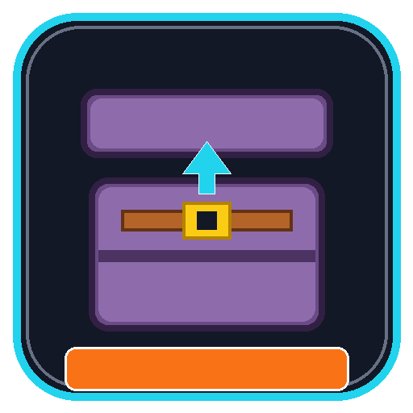

# QuickShulker × Inventorio Bridge

<p align="center">
  
</p>

<p align="center">
  <a href="https://neoforged.net/"></a>
  <a href="https://minecraft.net/"></a>
  <a href="LICENSE"></a>
  <a href="https://github.com/itsyusei99"></a>
</p>

---

A lightweight NeoForge compatibility mod that allows **QuickShulker** to interact with all custom inventory slots added by **Inventorio** (such as Deep Pockets and ToolBelt).

Without this bridge, QuickShulker only recognizes the standard 36 vanilla inventory slots, causing right-clicking or keybind-opening shulker boxes inside Inventorio's extra rows to fail or close abruptly.

---

## ✨ Features

- **Right-Click & Keybind Opening**: Open shulker boxes directly from Inventorio's **Deep Pockets** or **ToolBelt** rows with a simple right-click or using your configured QuickShulker hotkey (`K`).
- **Item Bundling Support**: Drag or click items over shulkers in Inventorio rows to insert or extract items on the fly.
- **Menu-Independent Session Validation**: Prevents the server from dropping or rejecting shulker interactions when switching between the inventory screen and the shulker interface.
- **Fail-Open Safety**: Built with isolated, fail-open Mixins (`require = 0`). If either mod is updated or uninstalled, vanilla behavior is completely preserved without crashes.
- **Full Multiplayer & Dedicated Server Support**: Works seamlessly in both Singleplayer and Dedicated Server environments.

---

## 📋 Requirements

| Mod | Version | Loader |
| :--- | :--- | :--- |
| **Minecraft** | `1.21.1` | — |
| **NeoForge** | `21.1.249` (or newer `21.1.x`) | NeoForge |
| **QuickShulker NeoForged** | `1.0.0`+ | NeoForge |
| **Inventorio** | `1.11.0`+ | NeoForge |

---

## 📥 Installation

1. Make sure you have **NeoForge 1.21.1** installed.
2. Install **QuickShulker NeoForged** and **Inventorio**.
3. Drop `qsbridge-1.0.0.jar` into your `.minecraft/mods` folder (both client and server if playing multiplayer).
4. Launch the game and enjoy!

---

## 🛠️ Building from Source

This project uses NeoGradle with Java 21:

```bash
git clone https://github.com/itsyusei99/QuickShulker-Inventorio-Bridge.git
cd QuickShulker-Inventorio-Bridge
./gradlew build
```

The compiled JAR will be located at `build/libs/qsbridge-1.0.0.jar`.

---

## 📄 License

This mod is available under the **MIT License**. Feel free to use it in any modpack!

Created by **[itsyusei99](https://github.com/itsyusei99)**.
